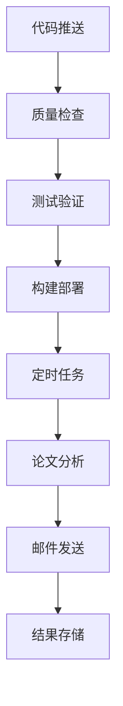

# ArXiv 论文追踪器 - 开发部署计划

## 🎯 项目目标

使用 GitHub Actions 实现 ArXiv 论文追踪器的完全自动化部署和运行，包括：
- 每日自动论文分析
- 自动邮件报告发送
- 多环境部署支持
- 持续集成和质量保证

## 📋 开发阶段规划

### 阶段 1: 基础设施完善 ✅ (已完成)

#### 1.1 项目现代化 ✅
- [x] 迁移到 uv 包管理器
- [x] 创建 pyproject.toml 配置
- [x] 模块化代码架构
- [x] 完善的 Makefile 工具链

#### 1.2 代码质量保证 ✅
- [x] pytest 测试框架
- [x] pre-commit hooks
- [x] 代码格式化和检查
- [x] 类型检查和安全扫描

#### 1.3 文档和脚本 ✅
- [x] 完整的项目文档
- [x] uv 脚本功能实现
- [x] 性能监控工具

### 阶段 2: GitHub Actions 自动化部署 🚧 (进行中)

#### 2.1 核心工作流设计



#### 2.2 工作流文件结构
```
.github/workflows/
├── ci.yml                    # 持续集成
├── quality.yml               # 代码质量检查
├── daily_paper_analysis.yml  # 每日论文分析
├── deploy.yml                # 部署工作流
├── release.yml               # 版本发布
└── cleanup.yml               # 清理任务
```

### 阶段 3: 生产环境部署 📅 (计划中)

#### 3.1 部署策略
- **GitHub Pages**: 静态报告展示
- **GitHub Actions Runner**: 论文分析执行
- **GitHub Secrets**: 敏感信息管理
- **GitHub Releases**: 版本管理

#### 3.2 环境配置
- **开发环境**: 本地开发和测试
- **测试环境**: PR 自动测试
- **生产环境**: 定时任务执行

## 🔄 GitHub Actions 工作流详解

### 1. 持续集成工作流 (ci.yml)

```yaml
name: Continuous Integration

on:
  push:
    branches: [ main, develop ]
  pull_request:
    branches: [ main ]

jobs:
  test:
    strategy:
      matrix:
        os: [ubuntu-latest, windows-latest, macos-latest]
        python-version: ['3.10', '3.11', '3.12']
    
    runs-on: ${{ matrix.os }}
    
    steps:
    - uses: actions/checkout@v4
    
    - name: Set up uv
      uses: astral-sh/setup-uv@v4
      with:
        version: "latest"
    
    - name: Set up Python ${{ matrix.python-version }}
      run: uv python install ${{ matrix.python-version }}
    
    - name: Install dependencies
      run: uv sync --all-extras
    
    - name: Run tests
      run: uv run pytest tests/ -v --cov=src
    
    - name: Upload coverage
      uses: codecov/codecov-action@v3
```

### 2. 每日论文分析工作流 (daily_paper_analysis.yml)

```yaml
name: Daily Paper Analysis

on:
  schedule:
    - cron: '0 0 * * *'  # 每天 UTC 00:00 (北京时间 08:00)
  workflow_dispatch:     # 手动触发

jobs:
  analyze:
    runs-on: ubuntu-latest
    
    steps:
    - uses: actions/checkout@v4
    
    - name: Set up uv
      uses: astral-sh/setup-uv@v4
    
    - name: Install dependencies
      run: uv sync --frozen
    
    - name: Run paper analysis
      env:
        DEEPSEEK_API_KEY: ${{ secrets.DEEPSEEK_API_KEY }}
        SMTP_SERVER: ${{ secrets.SMTP_SERVER }}
        SMTP_PORT: ${{ secrets.SMTP_PORT }}
        SMTP_USERNAME: ${{ secrets.SMTP_USERNAME }}
        SMTP_PASSWORD: ${{ secrets.SMTP_PASSWORD }}
        EMAIL_FROM: ${{ secrets.EMAIL_FROM }}
        EMAIL_TO: ${{ secrets.EMAIL_TO }}
      run: |
        cd src
        uv run python main.py
    
    - name: Upload analysis results
      uses: actions/upload-artifact@v3
      with:
        name: analysis-results
        path: src/conclusion.md
    
    - name: Commit results
      run: |
        git config --local user.email "action@github.com"
        git config --local user.name "GitHub Action"
        git add src/conclusion.md
        git commit -m "📚 Daily paper analysis - $(date +'%Y-%m-%d')" || exit 0
        git push
```

### 3. 部署工作流 (deploy.yml)

```yaml
name: Deploy to Production

on:
  push:
    tags:
      - 'v*'
  workflow_dispatch:

jobs:
  deploy:
    runs-on: ubuntu-latest
    
    steps:
    - uses: actions/checkout@v4
    
    - name: Set up uv
      uses: astral-sh/setup-uv@v4
    
    - name: Build package
      run: uv build
    
    - name: Deploy to GitHub Pages
      uses: peaceiris/actions-gh-pages@v3
      with:
        github_token: ${{ secrets.GITHUB_TOKEN }}
        publish_dir: ./docs
    
    - name: Create Release
      uses: actions/create-release@v1
      env:
        GITHUB_TOKEN: ${{ secrets.GITHUB_TOKEN }}
      with:
        tag_name: ${{ github.ref }}
        release_name: Release ${{ github.ref }}
        draft: false
        prerelease: false
```

## 🔐 环境变量和密钥管理

### GitHub Secrets 配置

在 GitHub 仓库设置中添加以下 Secrets：

#### 必需的 API 密钥
```
DEEPSEEK_API_KEY=your_deepseek_api_key
```

#### 邮件服务配置
```
SMTP_SERVER=smtp.qq.com
SMTP_PORT=587
SMTP_USERNAME=your_email@qq.com
SMTP_PASSWORD=your_email_auth_code
EMAIL_FROM=your_email@qq.com
EMAIL_TO=recipient1@example.com,recipient2@example.com
```

#### 可选配置
```
CATEGORIES=cs.AI,cs.LG,cs.CL
MAX_PAPERS=50
SEARCH_DAYS=2
```

### 环境变量验证脚本

```bash
# scripts/validate_env.py
#!/usr/bin/env python3
# /// script
# requires-python = ">=3.10"
# dependencies = ["python-dotenv>=1.0.0"]
# ///

import os
import sys

required_vars = [
    'DEEPSEEK_API_KEY',
    'SMTP_SERVER',
    'SMTP_USERNAME', 
    'SMTP_PASSWORD',
    'EMAIL_FROM',
    'EMAIL_TO'
]

missing_vars = []
for var in required_vars:
    if not os.getenv(var):
        missing_vars.append(var)

if missing_vars:
    print(f"❌ 缺少环境变量: {', '.join(missing_vars)}")
    sys.exit(1)
else:
    print("✅ 所有必需的环境变量都已设置")
```

## 📊 监控和通知

### 1. 工作流状态监控

```yaml
# .github/workflows/monitor.yml
name: Workflow Monitor

on:
  workflow_run:
    workflows: ["Daily Paper Analysis"]
    types: [completed]

jobs:
  notify:
    runs-on: ubuntu-latest
    if: ${{ github.event.workflow_run.conclusion == 'failure' }}
    
    steps:
    - name: Send failure notification
      uses: 8398a7/action-slack@v3
      with:
        status: failure
        text: "📚 论文分析工作流失败"
      env:
        SLACK_WEBHOOK_URL: ${{ secrets.SLACK_WEBHOOK }}
```

### 2. 性能监控

```yaml
# 在 daily_paper_analysis.yml 中添加
- name: Performance monitoring
  run: |
    uv run scripts/benchmark.py > performance.log
    
- name: Upload performance data
  uses: actions/upload-artifact@v3
  with:
    name: performance-data
    path: performance.log
```

## 🚀 部署时间表

### 第1周: 工作流基础设施
- [ ] 创建所有 GitHub Actions 工作流文件
- [ ] 配置环境变量和密钥
- [ ] 测试基本的 CI/CD 流程

### 第2周: 自动化论文分析
- [ ] 完善每日分析工作流
- [ ] 实现错误处理和重试机制
- [ ] 添加结果存储和版本控制

### 第3周: 监控和优化
- [ ] 实现工作流监控
- [ ] 添加性能分析
- [ ] 优化执行效率

### 第4周: 文档和发布
- [ ] 完善部署文档
- [ ] 创建用户指南
- [ ] 正式发布 v1.0

## 📈 成功指标

### 技术指标
- [ ] 工作流成功率 > 95%
- [ ] 平均执行时间 < 10分钟
- [ ] 代码覆盖率 > 80%
- [ ] 零安全漏洞

### 业务指标
- [ ] 每日自动分析论文
- [ ] 邮件发送成功率 > 99%
- [ ] 用户满意度 > 4.5/5
- [ ] 系统可用性 > 99.9%

## 🔧 故障排除和维护

### 常见问题处理
1. **API 限制**: 实现智能重试和降级策略
2. **网络问题**: 添加超时和重试机制
3. **邮件发送失败**: 多邮件服务商支持
4. **存储空间**: 自动清理旧文件

### 维护计划
- **每周**: 检查工作流状态和性能
- **每月**: 更新依赖和安全补丁
- **每季度**: 评估和优化整体架构

## 🎯 下一步行动

### 立即执行 (本周)
1. 创建完整的 GitHub Actions 工作流
2. 配置所有必需的环境变量
3. 测试端到端的自动化流程

### 短期目标 (1个月内)
1. 实现稳定的每日自动分析
2. 完善监控和告警系统
3. 优化性能和可靠性

### 长期愿景 (3个月内)
1. 支持多种部署环境
2. 实现智能化的论文推荐
3. 构建用户社区和反馈系统

---

**这个计划将确保我们充分利用 GitHub Actions 的强大功能，实现完全自动化的论文追踪和分析系统！** 🚀 