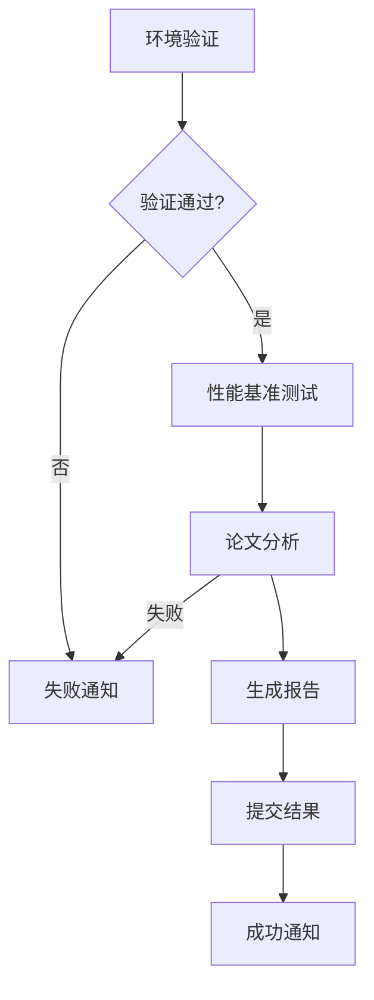

# 🚀 ArXiv 论文追踪器部署指南

本指南将帮助您使用 GitHub Actions 完成 ArXiv 论文追踪器的自动化部署。

## 📋 部署前准备

### 1. 环境要求

- GitHub 账号
- DeepSeek API 密钥
- 邮箱服务（推荐 QQ 邮箱或 Gmail）

### 2. 获取 API 密钥

#### DeepSeek API
1. 访问 [DeepSeek 官网](https://platform.deepseek.com/)
2. 注册账号并登录
3. 进入 API 管理页面
4. 创建新的 API 密钥
5. 复制密钥备用

#### 邮箱授权码
**QQ 邮箱**:
1. 登录 QQ 邮箱
2. 设置 → 账户 → POP3/IMAP/SMTP/Exchange/CardDAV/CalDAV服务
3. 开启 SMTP 服务
4. 生成授权码

**Gmail**:
1. 开启两步验证
2. 生成应用专用密码

## 🔧 GitHub 仓库配置

### 1. Fork 或克隆仓库

```bash
git clone https://github.com/你的用户名/arxiv_paper_tracker.git
cd arxiv_paper_tracker
```

### 2. 配置 GitHub Secrets

在 GitHub 仓库页面，进入 `Settings` → `Secrets and variables` → `Actions`，添加以下 Secrets：

#### 必需的 Secrets

| 名称 | 描述 | 示例 |
|------|------|------|
| `DEEPSEEK_API_KEY` | DeepSeek API 密钥 | `sk-xxxxxxxxxxxxxxxx` |
| `SMTP_SERVER` | SMTP 服务器地址 | `smtp.qq.com` |
| `SMTP_PORT` | SMTP 端口 | `587` |
| `SMTP_USERNAME` | 邮箱用户名 | `your_email@qq.com` |
| `SMTP_PASSWORD` | 邮箱授权码 | `your_auth_code` |
| `EMAIL_FROM` | 发件人邮箱 | `your_email@qq.com` |
| `EMAIL_TO` | 收件人邮箱 | `recipient@example.com` |

#### 可选的 Variables

在 `Variables` 标签页添加：

| 名称 | 描述 | 默认值 |
|------|------|--------|
| `CATEGORIES` | 论文类别 | `cs.AI,cs.LG,cs.CL` |
| `MAX_PAPERS` | 最大论文数 | `50` |
| `SEARCH_DAYS` | 搜索天数 | `2` |

### 3. 验证配置

使用本地验证脚本检查配置：

```bash
# 创建 .env 文件（仅用于本地测试）
cp .env.example .env
# 编辑 .env 文件，填入相应值

# 验证环境变量
make validate-env
```

## 🔄 GitHub Actions 工作流

### 1. 工作流文件结构

```
.github/workflows/
├── ci.yml                           # 持续集成
├── quality.yml                      # 代码质量检查
├── daily_paper_analysis.yml         # 原始每日分析
├── daily_paper_analysis_enhanced.yml # 增强版每日分析
└── test.yml                         # 测试工作流
```

### 2. 主要工作流说明

#### Enhanced Daily Paper Analysis
- **触发时间**: 每天 UTC 00:00 (北京时间 08:00)
- **手动触发**: 支持自定义参数
- **功能**:
  - 环境验证
  - 性能基准测试
  - 论文分析
  - 结果通知

#### 工作流作业流程



## 🚀 部署步骤

### 第一步: 基础配置

1. **Fork 仓库**
   ```bash
   # 在 GitHub 上 Fork 仓库
   # 然后克隆到本地
   git clone https://github.com/你的用户名/arxiv_paper_tracker.git
   ```

2. **配置 Secrets**
   - 按照上述表格添加所有必需的 Secrets
   - 确保邮箱和 API 密钥有效

3. **验证配置**
   ```bash
   # 本地验证
   make validate-env
   ```

### 第二步: 测试工作流

1. **手动触发测试**
   - 进入 GitHub 仓库的 Actions 页面
   - 选择 "Enhanced Daily Paper Analysis"
   - 点击 "Run workflow"
   - 使用默认参数或自定义参数

2. **检查执行结果**
   - 查看工作流日志
   - 检查是否有错误
   - 验证邮件是否发送成功

### 第三步: 启用自动化

1. **确认定时任务**
   - 工作流将在每天 UTC 00:00 自动运行
   - 对应北京时间早上 08:00

2. **监控运行状态**
   - 定期检查 Actions 页面
   - 查看工作流执行历史
   - 关注失败通知

## 📊 监控和维护

### 1. 工作流监控

#### 查看执行状态
```bash
# 使用 GitHub CLI (可选)
gh run list --workflow="Enhanced Daily Paper Analysis"
```

#### 关键指标
- 成功率 > 95%
- 平均执行时间 < 10分钟
- 邮件发送成功率 > 99%

### 2. 常见问题排查

#### API 相关问题
```bash
# 检查 API 密钥
curl -H "Authorization: Bearer $DEEPSEEK_API_KEY" \
     https://api.deepseek.com/v1/models
```

#### 邮件发送问题
- 检查 SMTP 配置
- 验证授权码有效性
- 确认邮箱服务状态

#### 网络连接问题
- 检查 ArXiv 服务状态
- 验证 GitHub Actions 网络连接

### 3. 性能优化

#### 缓存优化
- uv 依赖缓存
- Python 版本缓存
- 论文下载缓存

#### 执行时间优化
- 并行处理
- 智能重试
- 资源限制

## 🔧 高级配置

### 1. 自定义分析参数

通过 GitHub Variables 配置：

```yaml
# 在工作流中使用
env:
  CATEGORIES: ${{ vars.CATEGORIES || 'cs.AI,cs.LG,cs.CL' }}
  MAX_PAPERS: ${{ vars.MAX_PAPERS || '50' }}
  SEARCH_DAYS: ${{ vars.SEARCH_DAYS || '2' }}
```

### 2. 多环境部署

#### 开发环境
```yaml
# .github/workflows/dev_analysis.yml
on:
  push:
    branches: [ develop ]
```

#### 生产环境
```yaml
# .github/workflows/prod_analysis.yml
on:
  schedule:
    - cron: '0 0 * * *'
```

### 3. 通知集成

#### Slack 通知
```yaml
- name: Slack Notification
  uses: 8398a7/action-slack@v3
  with:
    status: ${{ job.status }}
    webhook_url: ${{ secrets.SLACK_WEBHOOK }}
```

#### 企业微信通知
```yaml
- name: WeChat Work Notification
  uses: chf007/action-wechat-work@master
  with:
    webhook_url: ${{ secrets.WECHAT_WEBHOOK }}
```

## 📈 扩展功能

### 1. 数据持久化

#### GitHub Pages 展示
```yaml
- name: Deploy to GitHub Pages
  uses: peaceiris/actions-gh-pages@v3
  with:
    github_token: ${{ secrets.GITHUB_TOKEN }}
    publish_dir: ./reports
```

#### 数据库存储
- 集成 Supabase
- 使用 GitHub Issues 作为数据库
- 连接外部数据库

### 2. 智能化功能

#### 论文推荐
- 基于历史偏好
- 关键词匹配
- 引用关系分析

#### 趋势分析
- 热门话题识别
- 研究方向预测
- 作者影响力分析

## 🛡️ 安全最佳实践

### 1. 密钥管理
- 定期轮换 API 密钥
- 使用最小权限原则
- 监控密钥使用情况

### 2. 访问控制
- 限制仓库访问权限
- 审核协作者权限
- 启用分支保护

### 3. 审计日志
- 定期检查 Actions 日志
- 监控异常活动
- 备份重要数据

## 🆘 故障排除

### 常见错误及解决方案

#### 1. 环境变量未设置
```
❌ 缺少必需的环境变量: DEEPSEEK_API_KEY
```
**解决方案**: 检查 GitHub Secrets 配置

#### 2. API 调用失败
```
❌ API 调用失败: 401 Unauthorized
```
**解决方案**: 验证 API 密钥有效性

#### 3. 邮件发送失败
```
❌ 邮件发送失败: Authentication failed
```
**解决方案**: 检查邮箱授权码

#### 4. 网络超时
```
❌ 网络请求超时
```
**解决方案**: 增加重试机制，检查网络连接

### 紧急恢复流程

1. **禁用自动化**
   - 暂时禁用定时触发
   - 停止正在运行的工作流

2. **问题诊断**
   - 查看详细日志
   - 检查系统状态
   - 验证配置正确性

3. **修复和测试**
   - 修复识别的问题
   - 手动测试工作流
   - 验证修复效果

4. **重新启用**
   - 恢复自动化设置
   - 监控后续运行

## 📞 支持和反馈

### 获取帮助
- 查看项目 Issues
- 阅读详细文档
- 参考示例配置

### 贡献代码
- Fork 仓库
- 创建功能分支
- 提交 Pull Request

---

**恭喜！您已经成功部署了 ArXiv 论文追踪器！** 🎉

现在您可以享受每日自动的论文分析和邮件报告了。如有任何问题，请参考故障排除部分或提交 Issue。 